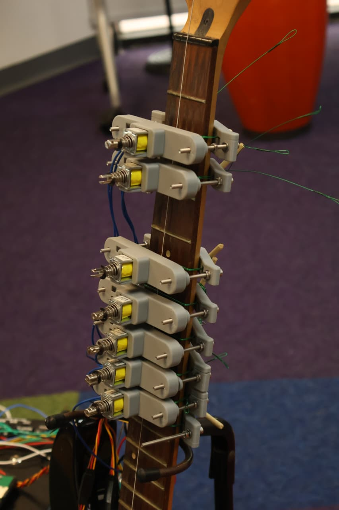
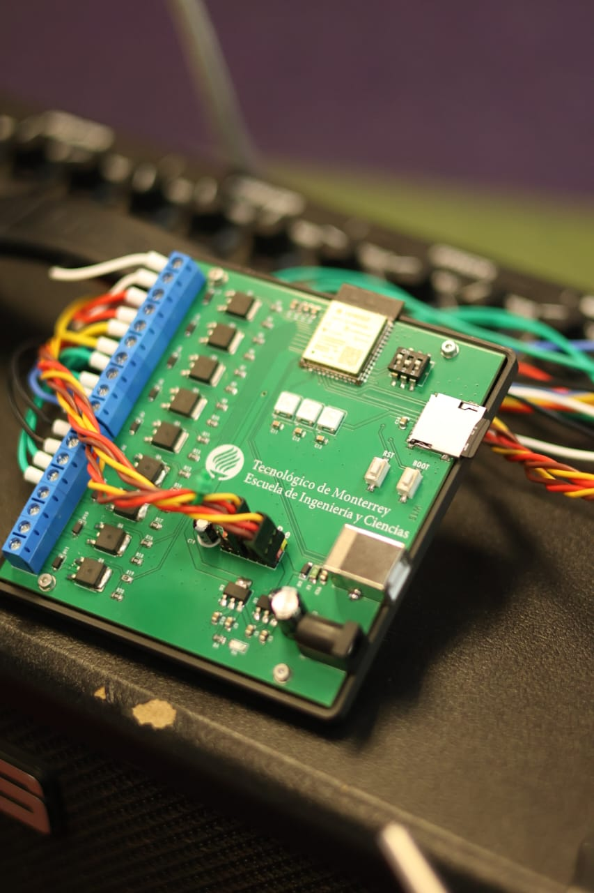

# ESP32-S3 Automated Guitar

An **ESP32-S3-based automated electric guitar** that physically plays programmed melodies using **servomotors and solenoids**, combining embedded systems, mechanical design, and digital music representation.

This project transforms a standard electric guitar into a **mechatronic musical instrument**, capable of executing predefined songs stored on a microSD card through real mechanical actuation.

---

## 🎸 Project Overview

Unlike digital synthesizers or MIDI-only systems, this project produces sound by **directly interacting with a real guitar**:

- **Solenoids** press the frets to define the pitch  
- **Servomotors** strum the strings  
- An **ESP32-S3** coordinates timing, actuation, and song execution  
- Songs are stored as simple text-based note sequences on a **microSD card**

The entire system is **non-invasive**, meaning it can be mounted and removed without permanently modifying or damaging the guitar.

  

---

## 🎥 Demo Video

Short demo video of the automated guitar performing a programmed sequence:

👉 **Watch the demo:**  
https://www.youtube.com/your-video-link

---

Songs are selected via **DIP switches**, allowing up to 8 different melodies without reflashing the firmware.

---

## ⚙️ Mechanical Design

### Fretting Mechanism (Solenoids)

- Linear solenoids mounted along the guitar neck  
- Each solenoid presses an entire fret when activated  
- Compact, fast, and mechanically simple  
- Designed to minimize noise and excessive force  

  

### Strumming Mechanism (Servomotors)

- One servomotor per string  
- Alternating motion simulates real strumming  
- Adjustable mounting system using linear rods  
- Non-invasive and fully removable  

All mechanical components were **custom-designed and 3D printed (PLA)**.

---

## 🔌 Electronics

The system is built around an **ESP32-S3**, selected for its performance, GPIO count, and PWM capabilities.

**Main components:**
- ESP32-S3 microcontroller  
- MicroSD card module (SPI)  
- Solenoids (fretting)  
- SG90 servomotors (strumming)  
- NeoPixel LEDs for visual feedback  
- Dedicated 5 V and 3.3 V power regulation  

  

### Electrical Schematic

  

---

## 🧩 Firmware Overview

The firmware is written using the Arduino framework for **ESP32-S3** and focuses on **deterministic timing and reliable actuation**.

### Key Concepts

- **Note abstraction**:
  - MIDI-like note ID  
  - Associated solenoid  
  - Associated servo channel  

- **Text-based song format**:
<note_midi>,<duration_ms>

- Servo position alternation to avoid double strumming  
- Conditional solenoid activation for open strings  
- Hardware-based song selection via DIP switches  

This approach avoids full MIDI parsing while preserving musical flexibility and embedded reliability.

---

## 📂 Repository Contents

- ESP32-S3 firmware source code  
- Electrical schematics (PNG / PDF)  
- Media assets (images and demo video links)

---

## 🏆 Project Context

Developed as part of an academic mechatronics project and **successfully demonstrated in a public engineering exhibition**, where it received **first place recognition (ExpoIngenierías 2025)**.

The project covers the full engineering cycle:
- Concept development  
- Mechanical design  
- Electronics  
- Embedded firmware  
- System integration and validation  

---

## 🚧 Limitations & Future Work

- Multi-string chord support  
- Velocity-sensitive strumming  
- Dynamic tempo control  
- MIDI file parsing  
- Closed-loop control for solenoids  

---

## 👤 Authors

Developed team *The RAMVerries*, whose memebers include:
- David González Verdejo
- Ethan Leonardo Guzmán Luna
- Sebastián León Medellín

---

## 📜 License

This project is shared for **educational and demonstrative purposes**.  
No warranty is provided; use at your own risk.
